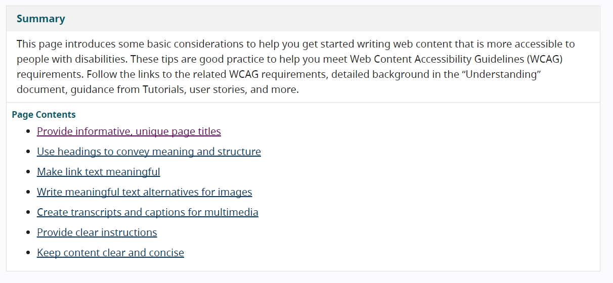
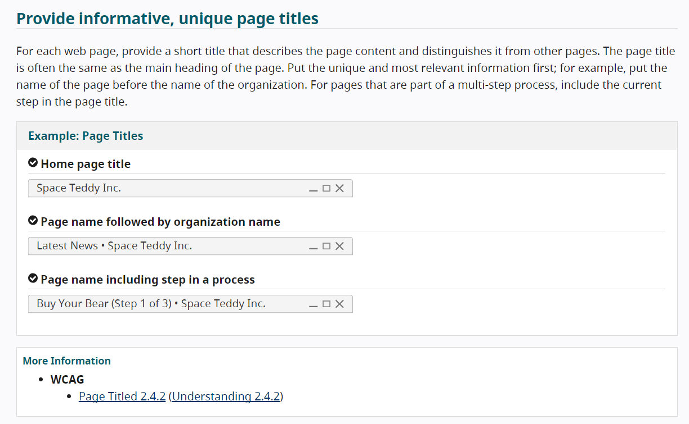
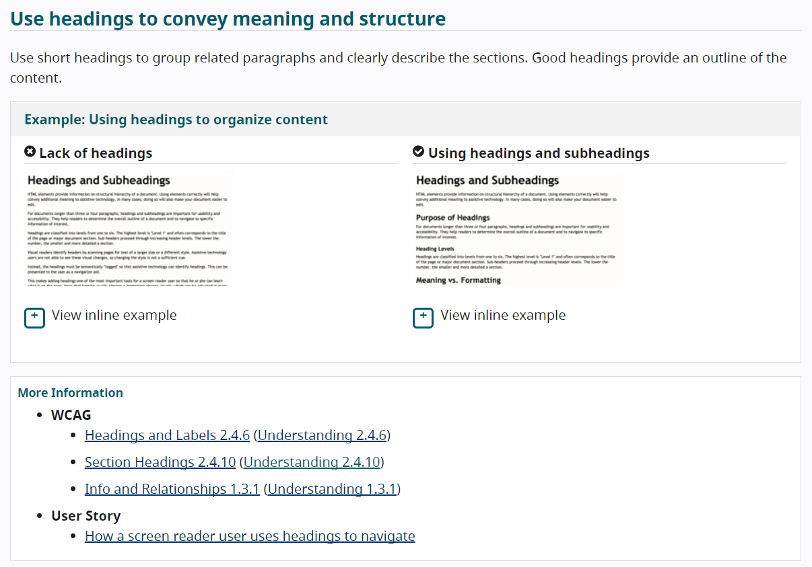
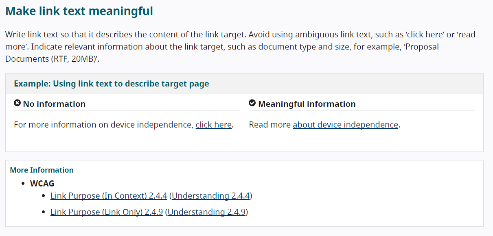

# Tips for Getting Started Writing for Web Accessibility
## 网页可访问性编写的原则 (麦安琪：181013118  丁晓莹：181013129）
***摘要：*** 此readme.md文档介绍了一些基本的需要考虑的注意事项，来帮助您开始写残疾人更容易访问的Web内容。这些原则是帮助您满足Web Content Accessibility Guidelines（WCAG）要求的良好做法。遵循相关WCAG要求的链接，理解文档中的详细背景、教程指南和用户案例等等。

***页面内容***
* 提供有用的信息、独特的页面标题
* 用标题传达含义和结构
* 让链接文字有意义的
* 为图片编写有意义的文本替代品
* 创建多媒体的文字记录和说明文字
* 提供明确的说明
* 保持内容清晰和简洁

### 提供有用的信息、独特的页面标题
对于每个网页，提供简短的标题，以至于描述页面内容并将其与其它页面区分。页面标题通常与页面主要标题相同。把独特以及最相关的信息放在首位；例如：将页面名称放在组织名称之前。对于多步骤过程的页面，请在页面标题中包括现在的步骤。

**示例：页面标题**
* ***主页标题：***Space Teddy Inc.
* ***页面名称后面跟着组织名称：***Latest News • Space Teddy Inc.
* ***包括流程中步骤的页面名称：***Buy Your Bear (Step 1 of 3) • Space Teddy Inc.

----

### 用标题传达含义和结构
使用短标题把相关段落分组并且清楚地描述各个部分。好的标题提供了内容的概述简述。

**示例：使用标题来组织内容**
* ***标题缺乏***（下图左）
* ***使用标题和副标题***（下图右）

----

### 让链接文字有意义的
写链接文本，用来描述链接目标的内容。避免用模棱两可的链接文本，例如“单击此处”或“阅读更多”。指示有关链接目标相关的信息，例如：文档的类型和大小，又例如：“建议文档（RTF，20MB）”。

**示例：使用链接文本来描述目标页面**
* ***无信息：***有关设备独立性的更多信息，[请单击此处](https://baike.baidu.com/item/%E8%AE%BE%E5%A4%87%E7%8B%AC%E7%AB%8B%E6%80%A7/7095927?fr=aladdin)。
* ***有意义的信息：***阅读[有关设备独立性](https://baike.baidu.com/item/%E8%AE%BE%E5%A4%87%E7%8B%AC%E7%AB%8B%E6%80%A7/7095927?fr=aladdin)的更多信息。

----
